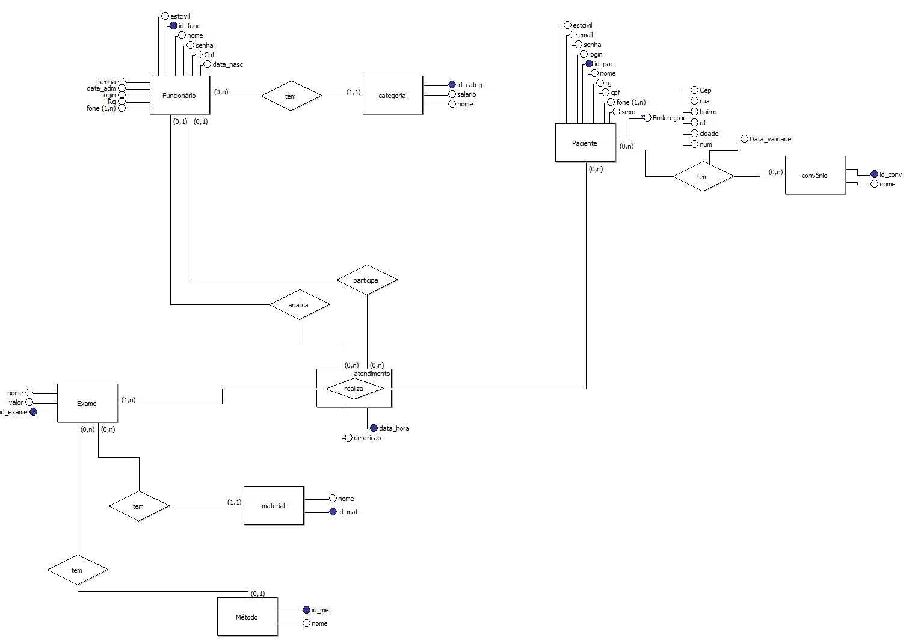
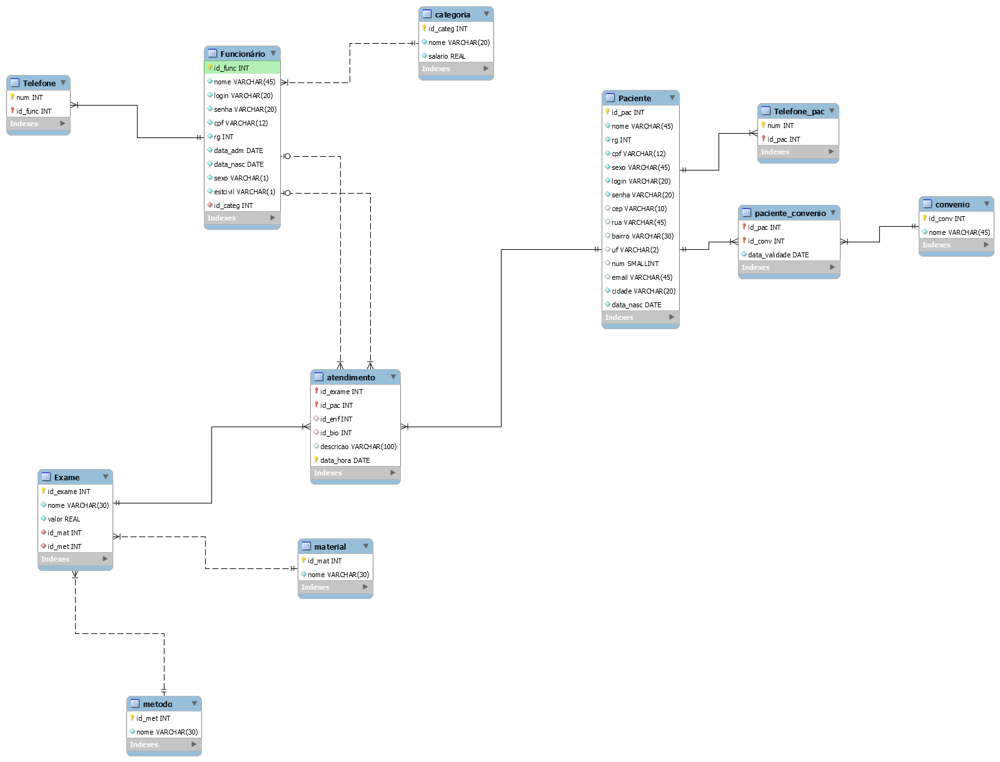

# Clínica

Projeto para a disciplina de Banco de Dados II do terceiro período de TSI no IFPB.

Grupo:
* [John Oliver]
* [Tales Medeiros]
* [Marlon Fernando]

## Descrição

O sistema deve ser capaz de controlar o agendamento, realização e pagamento dos exames realizados em um laboratório. Cada agendamento é registrado na recepção pelo atendente que é responsável pelo atendimento dos clientes, aceitar o guia dos exames e  informar qual a preparação do seu exame, como jejum, não fazer atividade física e etc. Os dados de cada atendente devem ser registrados no sistema, de forma que ele possa gerar um agendamento que inclua todos os dados do cliente. Se o cliente tiver plano, ele deverá levar a requisição para poder agendar a data do exame, se não tiver, ele deverá realizar o pagamento para poder agendar, com ou sem requisição médica. No Ato da coleta, o paciente deverá comparecer na data e hora agendada para serem coletadas as amostras, que será realizado pelo(a) enfermeiro(a) ou estagiário. As amostras coletadas serão encaminhadas ao laboratório, onde serão analisadas pelo bioquímico ou biomédico. Após analisadas as amostras, o laudo do exame deverá ser realizado pelo mesmo profissional que as analisou (Bioquímico ou Biomédico), em seguida, o laudo é inserido no sistema e liberado para a impressão que será entregue na recepção. O Sistema deve registrar os pagamentos efetuados pelos clientes sem convênio assim como o registro dos exames dos clientes com convênio e fornecer relatórios como estatística de exames realizados e relatório semanal de controle, etc.

### Modelo Conceitual

### Modelo Lógico

[John Oliver]: <https://github.com/johnoliver23>
[Tales Medeiros]: <https://github.com/Tales313>
[Marlon Fernando]: <https://github.com/marlonfernando16>
